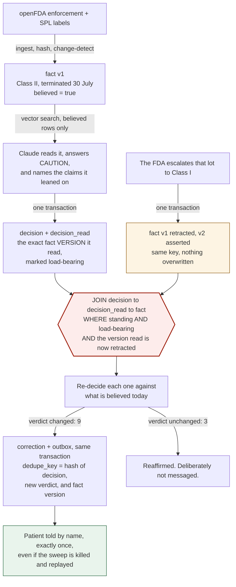

# Unsay

**An AI medication-safety agent that goes back and un-says what it told you.**

**[Watch the 2:34 demo](https://www.youtube.com/watch?v=UiWwvPHfN3A)**
· **[Live demo](https://dzcqeaznqrb2dwvy3h4btiavrm0etzef.lambda-url.us-east-1.on.aws/)**
· [health](https://dzcqeaznqrb2dwvy3h4btiavrm0etzef.lambda-url.us-east-1.on.aws/api/health)
· AWS Lambda in front of a CockroachDB Cloud cluster holding 554 live openFDA
claims. First request after a quiet spell pays a cold start of a few seconds.

Ask it whether your prescription is safe and it answers from live FDA data.
The part that matters comes later: when the FDA recalls that drug next
Tuesday, Unsay finds every person it already reassured, works out which of
those answers are now wrong, and corrects them. Each one, by name, in seconds.

Two claims, both demonstrated below rather than asserted:

> **Other agent memories can tell you what they knew. Unsay goes back and
> fixes what it said.**
>
> **And its replay still works in six months, when MVCC time-travel expired
> after twenty-five hours.**

---

## The problem this exists for

Agent memory has a failure mode that retrieval quality cannot fix: **stale
context**. Similarity to a stored memory does not prove that the memory is
still true. An agent retrieves a fact that was correct when it was written and
answers as if it were correct now.

For most agents that is embarrassing. In a pharmacy it is a Class I recall,
which the FDA defines as a reasonable probability of serious adverse health
consequences or death.[^fda]

The gap is documented. A 2024 study at an academic medical center,
[*Automating Individualized Notification of Drug Recalls to Patients*](https://www.ncbi.nlm.nih.gov/pmc/articles/PMC12798837/),
built a system to scan FDA recalls nightly and message affected patients
through their EHR portal. It hit two walls. Most recalls are Class II, so
notification "stops with wholesalers and pharmacies rather than reaching
patients." And critically: *"it was not possible to trace a medication
prescription from the EHR to specific lot numbers dispensed to that patient by
a community pharmacy."*[^study]

A recall is scoped to a lot. If you cannot resolve a lot to a person, you
either tell everybody or you tell nobody.

---

## Claim 1: repair, not just recall

When the FDA publishes a recall, some number of answers already given are now
wrong. They were correct when given. Nothing about them changed; the world
moved underneath them.

Finding them is this query:

```sql
SELECT d.decision_id, d.answer, d.verdict
  FROM decision d
  JOIN decision_read dr ON dr.decision_id = d.decision_id
  JOIN fact stale       ON stale.fact_key = dr.fact_key
                       AND stale.version  = dr.fact_version
 WHERE d.status = 'standing'
   AND dr.load_bearing
   AND stale.retracted_at IS NOT NULL;
```

Read it as English: *every answer still standing that leaned on a version of a
claim we no longer believe.*

**A vector database cannot express this query.** Not slowly, not
approximately. It has no notion that a memory has versions, and no record of
which version a given answer consumed. The most it can return is today's
nearest neighbours, which tells you nothing about what you said in March.

Reconstructing history is an insight layer. Unsay closes the loop: each
affected answer is re-decided against current memory, and where the verdict
moves, a correction is drafted and a notification queued for a named person.

---

## Claim 2: the replay does not expire

The obvious way to build "what did the agent know when it decided" on
CockroachDB is to store the read timestamp and replay it with
`AS OF SYSTEM TIME`. It is elegant, needs no extra tables, and is correct right
up until the garbage collector moves past the timestamp you saved.

CockroachDB's own documentation says so plainly: `gc.ttlseconds` *"is not meant
to be a solution for long-term retention of history; for that you should
handle versioning in the schema design at the application layer."*[^gcttl] The
default window is **4 hours**. **25 hours** is the largest value Cockroach Labs
regularly tests.[^aost]

So Unsay's durable mechanism is a **bitemporal schema**, which is what those
docs prescribe. Every claim carries two independent time axes:

- `valid_from` / `valid_to`: when the claim is true **in the world**
- `asserted_at` / `retracted_at`: when **this system** believed it

Keeping them apart is what separates "the drug became dangerous on March 3rd"
from "we found out on July 2nd", which is the difference between an unlucky
answer and a negligent one.

`AS OF SYSTEM TIME` remains as a fast path inside the window. `scripts/expiry.py`
asks one question both ways and prints both answers:

```
question: what did this system believe about sartan lot 88, 45 days ago?

route A -- bitemporal reconstruction
  ANSWERED: v1 [info] No open recall affects sartan lot 88.

route B -- MVCC time-travel (AS OF SYSTEM TIME at the same instant)
  FAILED: batch timestamp ... must be after replica GC threshold ...

control -- both routes at an instant inside the GC window
  bitemporal: v[2]   MVCC: v[2]   agree: True
```

The control matters as much as the failure: inside the window the two agree
exactly, so the bitemporal model is reconstructing real history rather than
inventing a convenient one. Past the horizon, one route is gone and the other
still answers.

---

## Architecture

```
   openFDA                AWS Lambda            Amazon Bedrock
 enforcement +   ──────▶  ingest +     ──────▶  Titan V2 embeddings
   SPL labels             change detect         Claude (the agent)
                               │                        │
                               ▼                        ▼
              ┌─────────────────────────────────────────────────┐
              │            CockroachDB  (memory)                │
              │                                                 │
              │  fact          bitemporal claims + VECTOR(1024) │
              │  decision      what the agent said              │
              │  decision_read which claim VERSION it read      │
              │  correction    what changed and why             │
              │  outbox        exactly-once patient notices     │
              │                                                 │
              │  us-east-1    us-west-2    eu-west-1            │
              │  SURVIVE REGION FAILURE   REGIONAL BY ROW       │
              └─────────────────────────────────────────────────┘
                               │
                               ▼
                     Amazon S3: raw snapshots,
                     signed audit exports
```

**There are two clusters, and they do different jobs.** The diagram above is
the local one: 9 nodes, 3 simulated AWS regions, `SURVIVE REGION FAILURE`,
which is what `docker compose` brings up and what the region-kill demo runs
against. The **hosted demo** is CockroachDB Cloud **Basic**, which is
single-region by design, so `/api/status` there reports one region and a
`zone` survival goal. That is not a discrepancy; multi-region on Cloud is an
Advanced-tier feature with custom pricing, and multi-region is not this
project's thesis. Every measured result below states which cluster produced it.

### The loop that makes this different

The diagram above is what the system is made of. This is what it does, and it
is the part no vector store can run: the arrow from a changed fact back to the
answers that were built on it.



Three properties carry the design.

**Provenance is written atomically with the answer.** The decision row and its
read set commit together or not at all. There is no code path that stores an
answer without recording what produced it, because an answer whose provenance
was lost can never be repaired, and a memory system that drops provenance
under load effectively has none.

**Corrections are exactly-once across a region failure.** The correction, the
status change, the outbox entry and the audit line are one transaction. The
outbox key is a deterministic hash of (decision, new verdict, triggering fact
version), so a sweep killed halfway and restarted recomputes the identical key
and the unique constraint turns the replay into a no-op. "Zero duplicate
patient notifications" is a property of the schema, not a hope about how the
process exits.

**Residency is enforced by storage, not by code.** `patient` is
`REGIONAL BY ROW`, so an EU patient's memory lives in `eu-west-1` because
CockroachDB puts it there.

The cluster runs 9 nodes across 3 simulated AWS regions under
`SURVIVE REGION FAILURE`, which places 5 replicas so no region holds a
majority.[^survival]

---

## CockroachDB tools used

The hackathon requires two.

| Tool | How it is used | Status |
|---|---|---|
| **Distributed Vector Indexing** | `CREATE VECTOR INDEX fact_semantic ON fact (believed, embedding vector_cosine_ops)`. The `believed` prefix column is the point: without it a top-K search spends part of its budget on retracted claims that get filtered afterwards, so a query asking for 8 results quietly returns 3. Prefixing means all K neighbours come from claims currently held true.[^vector] | live |
| **Agent Skills** | All 34 skills from [cockroachlabs/cockroachdb-skills](https://github.com/cockroachlabs/cockroachdb-skills) installed via `npx skills add`. `designing-application-transactions` was run against this codebase and found three real defects, listed below. | live |
| **Managed MCP Server** | `unsay/mcp.py` speaks JSON-RPC to `https://cockroachlabs.cloud/mcp` with a service-account key scoped to `mcp:read`, and `get_table_schema` returns the live definition of `fact` from the running cluster. Introspecting beats remembering: Cockroach Labs' stated reason for the server is that an agent working from a stale schema emits "brittle queries, schema mismatches, or unnecessary load".[^mcp] | live |
| **ccloud CLI** | `unsay/ccloud.py` shells out to it for a control-plane preflight that gates both bulk ingests: `ingest-recalls` and `ingest-warnings` ask whether the cluster is fit to write to before the first embedding is paid for, and abort if it is not. A SQL connection proves one query answered; it cannot say the cluster is suspended or mid-upgrade. One read verb is wired, `cluster list`, and nothing else: the destructive verbs exist in ccloud and are deliberately absent here, because an agent that can delete a cluster is a worse trade than one that cannot. Marked partial because authentication still cannot be automated, for the reason below. | partial |

Status is per row on purpose, and this table is the single place to check what
the artifact does rather than what it intends to.

**Feedback on ccloud, offered because the hackathon asks for it.** ccloud is
presented as agent-ready, and its noun-verb shape and JSON output genuinely
are. But `ccloud auth login` is browser OAuth only: version 0.8.23 accepts no
API key, and `CCLOUD_API_KEY`, `COCKROACH_CLOUD_API_KEY`, `CC_API_KEY` and
`CCLOUD_API_TOKEN` are all ignored. An agent therefore cannot authenticate it
unattended, which is a real gap for the exact use the tool is being pitched
for. The preflight above works only because a human completed that OAuth flow
once on this machine; it would not survive being run from CI or from an agent
with no browser. Provisioning (create a SQL user, create a database) was
therefore done against the Cloud REST API with a service-account key, which
does support headless auth. A `ccloud auth login --api-key` would close the
gap, and is the one change that would let an agent use this tool the way the
tool is described.

### What the Agent Skills actually caught

Running `designing-application-transactions` against this repo found three
defects that were really there, not three suggestions:

1. **Read-modify-write on version numbers.** `assert_claim` did
   `SELECT max(version)` then `INSERT version+1` as two statements. Two
   ingesters racing on the same drug can both decide they are version N+1.
   Fixed by computing the version inside `INSERT ... SELECT`.
2. **`SELECT *` in `replay_decision`**, pulling a 1024-dimension embedding over
   the wire for no reason.
3. **`LIMIT` without keyset pagination in the sweep.** Offset-style paging
   re-scans and discards everything already processed on each page. Now paged
   by `decision_id`, so the sweep starts correcting before it has finished
   enumerating.

The first was a genuine correctness bug under concurrency. The contention test
below exists because the skill prompted it.

## AWS services used

| Service | How it is used | Status |
|---|---|---|
| **Amazon Bedrock** | Titan Text Embeddings V2 produces the 1024-dimension vectors `VECTOR(1024)` is sized for; all 554 claims are embedded with it. Claude Sonnet 4.5 reasons over retrieved claims and names its own citations. Haiku 4.5 does bulk fact extraction in the benchmark, where call volume is ~40x the answer path and the work is mechanical. | live |
| **AWS Lambda** | Hosts the demo behind a public function URL. Chosen because it charges nothing while idle, and judging is four weeks of mostly idle. | live |
| **Amazon S3** | Raw openFDA snapshots and signed audit exports. | planned |

---

## The AI is the engine, not a commentator

The model reads the retrieved claims, decides the verdict, writes the answer,
and names which claims it leaned on. That last part is load-bearing: an answer
can only be invalidated later by evidence the model itself said it used. Reads
it was merely shown are recorded but marked non-load-bearing, so a change to
background context does not spuriously invalidate an answer that never
depended on it. That is what keeps a sweep from becoming spam.

One guardrail sits around it: the model may not return `safe` while an active
Class I or Class II recall for the same product is in its context. The verdict
is raised to `stop` and the override logged. The model still writes the answer
and picks the citations; it just cannot answer away a recall.

---

## What is measured

**From recall publication to twelve named patients, corrected: 42 seconds.**

The 2024 study this project is built on found it "was not possible to trace a
medication prescription to specific lot numbers dispensed to that patient", so
today a Class II recall stops at the pharmacy. The run below starts from the
FDA escalating a lot and ends with twelve people identified by name and
individually corrected. That is the number worth carrying out of this README;
everything under it is how it is true.

Measured on the **hosted** cluster unless the row says local:

| Property | Result |
|---|---|
| Real openFDA ingestion | 400 live enforcement records to **554 claims** across **315 drugs**, embedded with Titan V2 |
| Severity mix | 21 active Class I, 494 Class II, 39 Class III |
| Lot extraction | **455 of 554 (82.1%)** resolved to a specific lot rather than a whole drug |
| Idempotency | Re-ingesting identical claims produced **0** new versions |
| Sweep correctness | Standing answers built on superseded evidence found and reversed |
| Exactly-once | Sweep replayed after completion; outbox still held exactly 1 notice |
| Replay agreement | Bitemporal reconstruction and `AS OF SYSTEM TIME` returned identical read sets inside the window |
| **Replay durability** | At 45 days: bitemporal **answered exactly**, MVCC **failed** on the GC threshold |
| Concurrent writes | 128 writers across 128 claims: **176.9 memory writes/sec**, 0 failures |
| Worst-case contention | 64 writers, 16 racing on each of 4 claims: 0 failures, version chains dense at exactly v1..v16, exactly 1 believed version per claim, 0 orphaned provenance rows |

Idempotency matters more than it looks. openFDA refreshes weekly and most
records are unchanged. An ingester that versioned on every pass would fire 331
spurious sweeps and, at the far end, 331 spurious messages to patients.

**Which numbers used stub embeddings.** Only the contention test, where the
vectors are payload and the thing being measured is the database. Everything
about the corpus, retrieval and answers now runs on real Titan V2 vectors.

### LongMemEval: I ran it, it scored badly, and it is here anyway

I ran [LongMemEval](https://github.com/xiaowu0162/LongMemEval) (ICLR 2025)[^lme] on
its hard `longmemeval_s` split, graded by its own evaluator with the published
GPT-4o judge. The results are worse than the systems it would be compared to:

| Run | Result |
|---|---|
| temporal-reasoning, `s` split, n=39, k=10 | **20.5%** |
| same 12 instances, k=10 vs k=40 | 25% → 33.3% |
| Reported for Zep / Graphiti, same sub-task [^zepcmp] | 63.8% |
| Reported for Mem0, same sub-task [^zepcmp] | 49.0% |

Those two comparison figures deserve a caveat I did not give them at first.
They come from a third-party comparison [^zepcmp], not from Zep's own paper
[^zep], whose abstract reports "improvements up to 18.5%" on LongMemEval and
94.8% on DMR and does not state 63.8% anywhere I could find. So treat them as
indicative of the gap rather than as a precisely matched baseline. What is not
in doubt is the direction: 20.5% is well short of any published system.

The failure mode is specific and worth stating: **25 of 31 wrong answers were
"I don't know"**, not confident errors. With a median of 125 facts stored per
instance and a retrieval window of 10, the model mostly never sees the fact it
needs. Widening to 40 helped by one answer in twelve, which at that sample size
is noise, and left the gap roughly intact.

So this is a retrieval problem, not a storage one, and it is unsolved here. I
stopped rather than spend further on tuning, because the claims this project
actually makes (repairing past answers, and a replay that outlives the GC
window) are demonstrated by `scripts/expiry.py` and the sweep, and neither
depends on this benchmark.

It is reported because it was run. A number that came out badly is still a
measurement, and omitting it would leave the impression it was never tried.

---

## Running it

```bash
docker compose up -d
docker compose --profile init run --rm init

docker exec -i cockroachdb-crdb-use1-1-1 cockroach sql --insecure < sql/001_bootstrap.sql
docker exec -i cockroachdb-crdb-use1-1-1 cockroach sql --insecure < sql/002_schema.sql
docker exec -i cockroachdb-crdb-use1-1-1 cockroach sql --insecure < sql/003_vector.sql

python -m venv .venv && .venv/Scripts/pip install -e .
cp .env.example .env      # then fill in AWS + CockroachDB Cloud values

unsay status
unsay ingest-recalls --since 2024-01-01
unsay ask "Is my valsartan safe to keep taking?" --subject valsartan
unsay sweep --dry-run
```

Kill a region mid-demo and watch answers keep flowing:

```bash
docker compose stop crdb-euw1-1 crdb-euw1-2 crdb-euw1-3
unsay status          # eu-west-1 DOWN, survival goal holds
unsay sweep           # completes; outbox count does not double
```

**Full verification steps, ordered by effort, are in [TESTING.md](TESTING.md).**

Evidence scripts, all runnable without AWS via `UNSAY_ALLOW_FAKE_EMBEDDINGS=1`:

| Script | Proves |
|---|---|
| `scripts/smoke.py` | The full lifecycle: assert, answer with provenance, supersede, sweep, correct, exactly-once |
| `scripts/expiry.py` | Bitemporal replay outlives the GC window; MVCC replay does not |
| `scripts/concurrency.py` | Version chains stay dense and singly-believed under N-way races |

That stub-embedding switch is gated behind an environment variable and never a
silent fallback, because retrieval quality under stub embeddings is
meaningless.

---

## Limitations

Named plainly, because a safety tool that oversells itself is worse than none.

- **Lot extraction is regex over free text.** openFDA writes lot numbers into
  prose, not a structured field. Recalls with no parsable lot fall back to
  drug-level scope, which over-notifies rather than under-notifies.
- **The sweep does not pay for twelve identical model calls.** The twelve
  patients ask in four phrasings, so the sweep re-decides each distinct
  (question, retracted claim) pair once and applies the verdict to every
  decision that matches it. Twelve decisions are examined, re-decided and
  individually recorded; the reasoning behind them costs four calls rather than
  twelve. That is a cost control on a public unauthenticated demo, alongside a
  200-call daily cap and 40 per visitor per hour, and it is why three texts
  repeat across the nine notices. Three, not four, because the fourth phrasing
  ("should I be worried about my blood pressure tablets") already opens at
  `stop`, so its three patients are reaffirmed rather than corrected. They are
  the three the sweep deliberately leaves alone.
- **Dispensing data is synthetic.** Real pharmacy dispensing records are PHI
  and are not obtainable for a hackathon. The FDA side is entirely real and
  live; the patient side is generated.
- **The Class I escalation in the demo is staged, and labelled as such.** The
  drug, the lot `GB01616`, the original Class II and its 30 July termination
  are real openFDA records. Waiting for the FDA to genuinely re-escalate that
  lot is not a demo, so step 2 lets the operator publish the escalation, and
  the resulting version is stored with `source = 'demo:escalation'` rather than
  `openfda:enforcement`. Everything downstream of it, the retraction, the join,
  the re-decisions and the notices, runs for real against the live cluster.
- **Not a medical device.** openFDA's own terms state the data is unvalidated
  and must not be relied on for decisions regarding medical care.[^openfda] Unsay drafts
  a correction for a pharmacist to review. It does not contact patients
  autonomously.
- **`crdb_internal` is avoided.** v26.2 restricts it with a hint that it is
  unsupported in production. Cluster status is read through supported SQL and
  connection probes instead of setting `allow_unsafe_internals`.
- **The public function URL needs two IAM permissions, not one.** Function
  URLs created after October 2025 require `lambda:InvokeFunctionUrl` and
  `lambda:InvokeFunction` even under `AuthType: NONE`; granting only the first
  returns 403 against a policy that reads as correct.[^lambdaauth]
- **Region-failure survival needs a licence.** Enterprise Free, at no cost for
  companies under $10M revenue, from the CockroachDB Cloud console. Without it
  the schema still works single-region.

## Licence

MIT. See [LICENSE](LICENSE).

---

## References

Every external claim in this README traces to one of these. Where a figure
comes from a secondary source, that is said rather than implied.

[^study]: Automating Individualized Notification of Drug Recalls to Patients:
    Complex Challenges and Qualitative Evaluation (2024).
    <https://www.ncbi.nlm.nih.gov/pmc/articles/PMC12798837/>
    Source for: most recalls being Class II and notification stopping at
    wholesalers and pharmacies, and for prescriptions not being traceable to
    the lot dispensed. This is the gap the project exists to close.

[^fda]: FDA, Recalls Background and Definitions.
    <https://www.fda.gov/safety/industry-guidance-recalls/recalls-background-and-definitions>
    Source for: Class I meaning a reasonable probability of serious adverse
    health consequences or death.

[^gcttl]: CockroachDB, Configure Replication Zones.
    <https://www.cockroachlabs.com/docs/v26.2/configure-replication-zones>
    Source for the verbatim quote that `gc.ttlseconds` "is not meant to be a
    solution for long-term retention of history; for that you should handle
    versioning in the schema design at the application layer", and for the
    default window. Claim 2 rests entirely on this.

[^aost]: CockroachDB, AS OF SYSTEM TIME.
    <https://www.cockroachlabs.com/docs/v26.2/as-of-system-time>

[^survival]: CockroachDB, Multi-Region Survival Goals.
    <https://www.cockroachlabs.com/docs/v26.2/multiregion-survival-goals>
    Source for: `SURVIVE REGION FAILURE` placing five replicas so that no
    single region holds a majority.

[^vector]: CockroachDB, Vector Indexes.
    <https://www.cockroachlabs.com/docs/v26.2/vector-indexes>

[^mcp]: Cockroach Labs, Managed MCP Server for AI Agents.
    <https://www.cockroachlabs.com/blog/cockroachdb-ai-agents-managed-mcp-server/>
    Source for: schema hallucination being the stated problem the server
    exists to solve, and for the read-only-by-default posture.

[^lme]: LongMemEval: Benchmarking Chat Assistants on Long-Term Interactive
    Memory (ICLR 2025). <https://github.com/xiaowu0162/LongMemEval>
    The benchmark and its official GPT-4o evaluator, used unmodified except
    for pinning file reads to UTF-8 so it runs on Windows.

[^zep]: Rasmussen et al., Zep: A Temporal Knowledge Graph Architecture for
    Agent Memory (2025). <https://arxiv.org/abs/2501.13956>
    Primary source for Graphiti's temporal edges. Note it reports
    "improvements up to 18.5%" on LongMemEval and 94.8% on DMR, and does not
    state the 63.8% figure quoted in secondary comparisons.

[^zepcmp]: Atlan, Zep vs Mem0: Benchmarks, Pricing, and When to Use Each.
    <https://atlan.com/know/zep-vs-mem0/>
    Secondary source, and the origin of the 63.8% and 49.0% temporal-reasoning
    figures. Not verified against either project's primary publication.

[^openfda]: openFDA Drug Enforcement (recall) API.
    <https://open.fda.gov/apis/drug/enforcement/>
    The live data behind every claim in the corpus. Its terms state the data
    is not validated for clinical use, which is why this drafts a correction
    for a pharmacist rather than contacting anyone.

[^lambdaauth]: AWS, Control access to Lambda function URLs.
    <https://docs.aws.amazon.com/lambda/latest/dg/urls-auth.html>
    Source for function URLs requiring both `lambda:InvokeFunctionUrl` and
    `lambda:InvokeFunction` even under `AuthType: NONE`.
